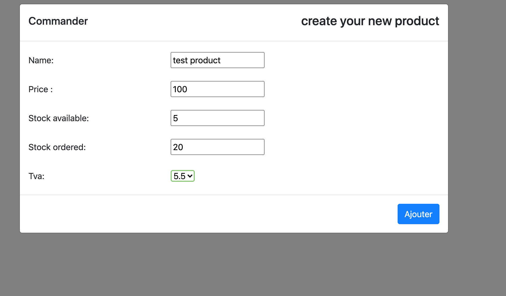
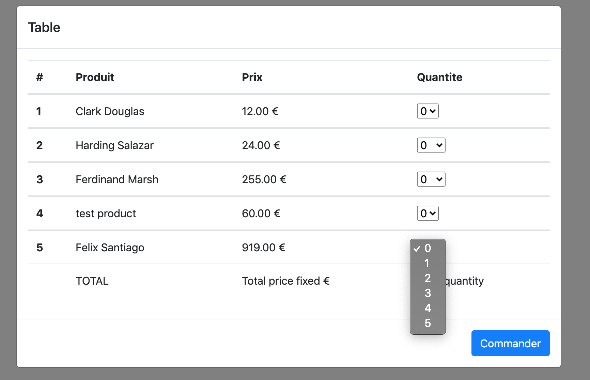
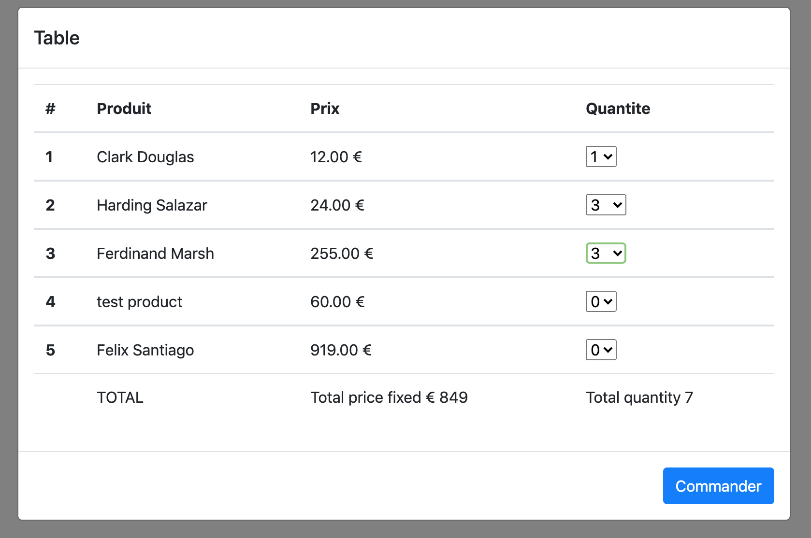
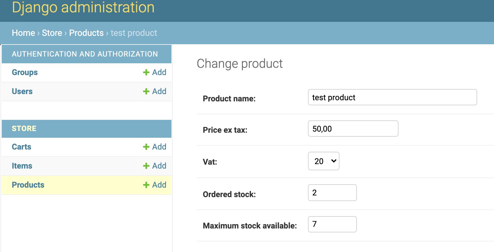

The landing page is here with entry and start shopping options

Product entry backoffice,

After product entry lets go to cart page
here all the entry products whose available stock is greater that 0 will be displayed
and the price is the price after tax is displayed.

here the dropdown is shown in quantity is as per available stock quantity.
so it wont be higher than the available stock number.

counting total and total item

here the price total of all item in cart is calculated.

the stock is maintained after the success command.
stock before order

order 3 in quantities,

stock after order

for installing project:
in your virtual env install requirements.txt components

